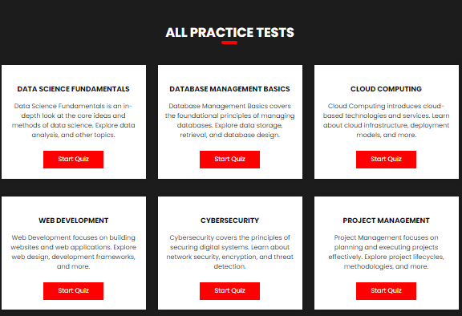
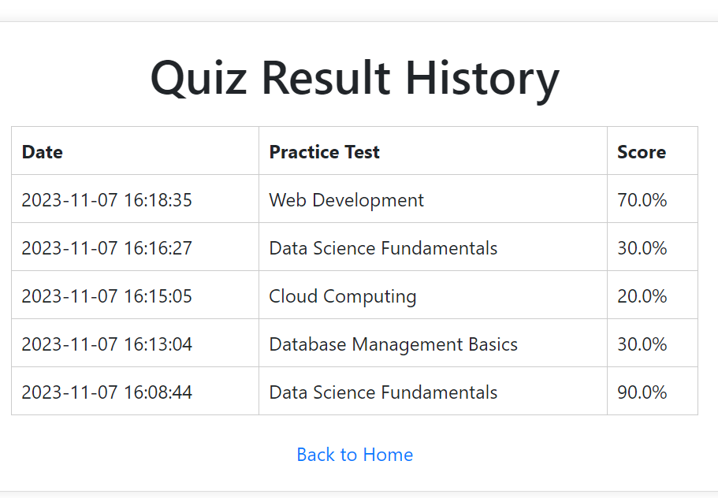

# Quiz Master

## Introduction

Welcome to Quiz Master - "Knowledge Unleashed, One Quiz Away." Quiz Master is a dynamic platform that enables users to create, participate in, and manage quizzes, fostering interactive learning and information exchange.

- **Author:** Opeyemi Ogunniyi
- **LinkedIn:** [Opeyemi Ogunniyi's LinkedIn](https://www.linkedin.com/in/opeyemi-adegboye-58a35b1b4/)
- **Deployed Site:** [Quiz Master](#link-to-your-deployed-site)
- **Final Project Blog Article:** [Quiz Master Blog Article](#link-to-your-final-project-blog-article)

## Technologies

- **Frontend:** HTML, CSS, JavaScript (for interactivity)
- **Backend:** Python Flask
- **Database:** MySQL

**Technology Trade-offs:**
- Frontend: JavaScript is included for enhanced interactivity.
- Database: Chose MySQL over PostgreSQL for compatibility with the application's data structure and requirements.

## Challenge Statement

**Problem Statement:** Quiz Master's mission is to provide a dynamic platform for users to develop, participate in, and manage quizzes, thereby promoting interactive learning and information exchange.

**What It Will Not Solve:** Quiz Master will not provide in-depth educational content but rather facilitate the creation and sharing of quizzes.

**Target Audience:** Students, educators, and quiz enthusiasts looking for an interactive learning tool.

**Locale:** The project is not location-dependent.

## Installation

1. Clone the repository:
   ```bash
   git clone https://github.com/your-username/quiz-master.git
   cd quiz-master

2. Install dependencies:
   pip install -r requirements.txt

## Usage

1. Run the application:
   python app.py / python3 app.py

2. Open your browser and navigate to http://127.0.0.1:5000/

## Related Projects
1. Quizlet
2. Kahoot

## Screenshots



